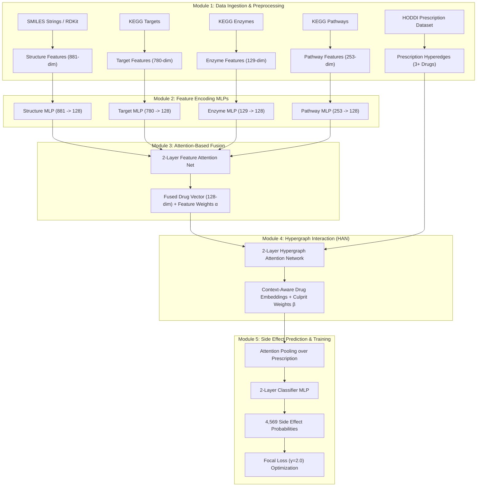

# Technical Specification Document: HyperAttDDI
## Deep Learning-Based Higher-Order Drug–Drug Interaction Prediction

### Project Metadata
- **Project Name:** HyperAttDDI (HODDI Project)
- **Document Version:** 1.0.0
- **Authors:** Tarunika Anand (23BCE1203), M Harshini (23BCE1974), Samyukta Srikanth (23BCE5136)
- **Guidance:** Dr. Renta Chintala Bhargavi, Professor, SCOPE, VIT Chennai
- **Target Application:** Polypharmacy Side-Effect Prediction & Culprit Drug Identification for Multi-Drug Prescriptions ($\ge 3$ drugs)

---

## 1. Executive Summary & System Overview

Polypharmacy—the simultaneous administration of multiple medications—is increasingly common, particularly among elderly populations (over 20% of elderly individuals take 10 or more medications). However, taking multiple drugs significantly elevates the risk of Adverse Drug Events (ADEs) and drug–drug interactions (DDIs). In the United States alone, DDIs contribute to 195,000 hospitalizations and 74,000 emergency room visits annually, resulting in a \$177 billion healthcare burden.

Traditional computational DDI prediction frameworks primarily focus on **pairwise (2-drug)** interactions. They fail to capture complex, non-additive higher-order interactions that emerge only when **3 or more drugs** are co-administered. Furthermore, existing methods rely on simple feature concatenation, treating all biological features equally regardless of the drug's primary mechanism of action, and suffer from severe performance degradation on rare side effects due to extreme class imbalance across side-effect types.

**HyperAttDDI** addresses these gaps through an end-to-end deep learning framework featuring:
1. **Multi-Feature Drug Representation:** 2,043-dimensional raw multi-view feature vectors per drug spanning molecular structure, target proteins, liver enzymes, and biological pathways.
2. **Attention-Based Feature Fusion:** Per-drug adaptive attention network that learns feature importance weights ($\alpha$), dynamically amplifying the dominant biological mechanism for each drug.
3. **Hypergraph Attention Interaction Modeling (HAN):** Hypergraph representation where patient prescriptions ($\ge 3$ drugs) form hyperedges, with 2-layer hypergraph message passing and drug culprit attention weights ($\beta$).
4. **Focal Loss Multi-Label Classification:** Classification head predicting probabilities across 4,569 clinical side-effect types, trained with Focal Loss ($\gamma = 2.0$) to overcome severe class imbalance and penalize hard, rare adverse events.

---

## 2. System Architecture & Component Interaction

The pipeline consists of 5 modular components arranged in an end-to-end differentiable neural architecture:



---

## 3. Detailed Module Specifications

### Module 1 (M1): Data Preprocessing & Multi-Feature Extraction
- **Input Data Sources:**
  - **HODDI Dataset:** Multi-drug prescriptions ($\ge 3$ drugs) paired with multi-label clinical side effects (4,569 classes).
  - **RDKit / SMILES:** Structural chemical informatics representations.
  - **KEGG Database:** Protein targets, metabolic enzymes, and biological pathways.
- **Drug Vector Feature Specification (2,043 total dimensions):**
  1. **Structure Features ($d_1 = 881$):** Binary PubChem/RDKit molecular fingerprints derived from canonical SMILES strings.
  2. **Target Features ($d_2 = 780$):** Binary vector representing human protein target interactions.
  3. **Enzyme Features ($d_3 = 129$):** Binary vector indicating cytochrome P450 and liver enzyme metabolism involvement.
  4. **Pathway Features ($d_4 = 253$):** Binary vector representing KEGG biological pathway participation.
- **Outputs:**
  - Standardized drug feature matrices $X^{(1)} \in \{0,1\}^{N \times 881}$, $X^{(2)} \in \{0,1\}^{N \times 780}$, $X^{(3)} \in \{0,1\}^{N \times 129}$, $X^{(4)} \in \{0,1\}^{N \times 253}$ for $N$ drugs.
  - Incidence Matrix $H \in \{0,1\}^{N \times M}$ where $H_{ij} = 1$ if drug $i$ belongs to prescription hyperedge $j$.
  - Multi-label side-effect matrix $Y \in \{0,1\}^{M \times 4569}$.

---

### Module 2 (M2): Feature Encoding Sub-MLPs
- **Purpose:** Map heterogeneous, sparse binary vectors of varying dimensionality into uniform, continuous 128-dimensional feature spaces.
- **Architecture:** Four independent 2-layer Multi-Layer Perceptrons ($\text{MLP}_k, k \in \{1,2,3,4\}$).
  $$\mathbf{h}_i^{(k)} = \text{Dropout}\left(\text{ReLU}\left(\mathbf{x}_i^{(k)} W_1^{(k)} + \mathbf{b}_1^{(k)}\right)\right) W_2^{(k)} + \mathbf{b}_2^{(k)}$$
- **Parameters:**
  - Layer 1 Linear transformation: $d_k \to 256$
  - Activation: ReLU
  - Dropout rate: $0.2$
  - Layer 2 Linear transformation: $256 \to 128$
- **Output:** Four dense embeddings $\{\mathbf{h}_i^{(1)}, \mathbf{h}_i^{(2)}, \mathbf{h}_i^{(3)}, \mathbf{h}_i^{(4)}\} \subset \mathbb{R}^{128}$ per drug $i$.

---

### Module 3 (M3): Attention-Based Feature Fusion Module
- **Purpose:** Dynamically score and weight the contribution of each feature type per individual drug.
- **Mechanism:** A 2-layer Attention Network computes scalar importance weights $\alpha_{i,k}$ for feature view $k$ of drug $i$:
  $$e_{i,k} = \mathbf{w}_a^T \tanh\left(W_a \mathbf{h}_i^{(k)} + \mathbf{b}_a\right)$$
  $$\alpha_{i,k} = \frac{\exp(e_{i,k})}{\sum_{j=1}^4 \exp(e_{i,j})}$$
- **Fused Drug Representation:**
  $$\mathbf{z}_i = \sum_{k=1}^4 \alpha_{i,k} \mathbf{h}_i^{(k)} \in \mathbb{R}^{128}$$
- **Key Capability:** Per-drug mechanism highlighting (e.g., amplification of enzyme features for metabolic drugs vs target features for receptor agonists).

---

### Module 4 (M4): Hypergraph Interaction Module (Hypergraph Attention Network - HAN)
- **Purpose:** Model multi-drug complex relationships within prescription hyperedges $e_j = \{d_{j_1}, d_{j_2}, \dots, d_{j_m}\}$ ($m \ge 3$).
- **Architecture:** 2-layer Hypergraph Attention Network with hyperedge-level message passing.
- **Culprit Drug Attention Weight ($\beta$):**
  Within prescription hyperedge $e_j$, the attention coefficient $\beta_{i,j}$ measuring the influence of drug $i$ on the hyperedge representation is defined by:
  $$s_{i,j} = \text{LeakyReLU}\left(\mathbf{a}_h^T \left[ W_h \mathbf{z}_i \parallel \mathbf{e}_j^{(l-1)} \right]\right)$$
  $$\beta_{i,j} = \frac{\exp(s_{i,j})}{\sum_{k \in e_j} \exp(s_{k,j})}$$
- **Message Passing Strategy:**
  1. Node to Hyperedge aggregation: $\mathbf{e}_j = \sum_{i \in e_j} \beta_{i,j} W_h \mathbf{z}_i$
  2. Hyperedge to Node update: $\mathbf{z}_i' = \text{ELU}\left(\sum_{j \in \mathcal{E}(i)} W_n \mathbf{e}_j\right)$
- **Output:**
  - Updated context-aware drug representations $\mathbf{z}_i' \in \mathbb{R}^{128}$.
  - Clinical culprit drug attribution scores $\vec{\beta}_j$ for each prescription (e.g., $[0.70, 0.20, 0.10]$ for a 3-drug combination).

---

### Module 5 (M5): Prediction & Multi-Label Training Pipeline
- **Prescription Aggregation:** Attention pooling over updated drug embeddings in prescription $e_j$ to form fixed-size hyperedge vector $\mathbf{u}_j \in \mathbb{R}^{128}$.
- **Classification MLP:** 2-layer neural network with Sigmoid activation outputting probability distribution $\hat{\mathbf{y}}_j \in [0,1]^{4569}$:
  $$\hat{\mathbf{y}}_j = \sigma\left(\text{Linear}_{128 \to 512}\left(\text{ReLU}\left(\text{Linear}_{128 \to 128}(\mathbf{u}_j)\right)\right)\right)$$
- **Loss Function (Focal Loss):**
  To handle extreme class imbalance across 4,569 side effects:
  $$\mathcal{L}_{\text{Focal}} = -\frac{1}{M} \sum_{j=1}^M \sum_{c=1}^{4569} \left[ y_{j,c} \alpha_c (1 - \hat{y}_{j,c})^\gamma \log(\hat{y}_{j,c}) + (1 - y_{j,c})(1 - \alpha_c) \hat{y}_{j,c}^\gamma \log(1 - \hat{y}_{j,c}) \right]$$
  Where hyperparameter $\gamma = 2.0$ down-weights easy negatives/positives and focuses gradient updates on hard, rare side effects.

---

## 4. Evaluation Protocol & Benchmark Strategy

### 4.1 Cross-Validation Setup
- **5-Fold Stratified Cross-Validation:** Prescriptions are split into 5 folds while maintaining multi-label side-effect distributions.
- **Optimization:** Adam optimizer ($\text{lr}=10^{-3}$, weight decay $= 10^{-5}$), learning rate warmup and cosine annealing scheduler.

### 4.2 Primary Performance Metrics
1. **Accuracy (Subset Accuracy / Jaccard Index)**
2. **Macro-F1 Score** (Unweighted mean across all 4,569 side-effect classes; evaluates rare side effect handling)
3. **Micro-F1 Score** (Global aggregate F1 score)
4. **ROC-AUC** (Receiver Operating Characteristic Area Under Curve)
5. **PR-AUC** (Precision-Recall Area Under Curve; essential for sparse positive labels)

### 4.3 Systematic Ablation Studies
Four controlled experiments will validate each design choice:
1. **Ablation 1 (Fusion Strategy):** Attention Fusion vs Equal Concatenation vs Mean Pooling.
2. **Ablation 2 (Graph Representation):** Hypergraph HAN vs Pairwise GCN/GAT vs Flattened MLP.
3. **Ablation 3 (Loss Function):** Focal Loss ($\gamma = 2.0$) vs Standard Binary Cross-Entropy (BCE).
4. **Ablation 4 (Input Modalities):** Multi-feature (2,043-dim) vs Single-feature modalities (Structure only, Target only).

---

## 5. Technology Stack & Directory Structure

- **Core Framework:** Python 3.10+, PyTorch 2.1+
- **Graph & Hypergraph Libraries:** PyTorch Geometric (PyG) / DGL / HypernetX
- **Cheminformatics & Bioinformatics:** RDKit, BioPython
- **Evaluation & Data Wrangling:** Scikit-learn, Pandas, NumPy, SciPy

```
HODDI_Project/
├── MiniProject_Review2_PPT.pdf  # Project Presentation Doc
├── SPECIFICATION.md             # This Technical Specification
├── TASK_LIST.md                 # Detailed Implementation Task Tracker
├── data/
│   ├── raw/                     # HODDI, KEGG, SMILES raw data
│   └── processed/               # Extracted 2043-dim features & hypergraph incidence matrices
├── models/
│   ├── encoders.py              # M2: 4 Sub-MLP Encoders
│   ├── fusion.py                # M3: 2-Layer Feature Attention Fusion Net
│   ├── hypergraph.py            # M4: 2-Layer Hypergraph Attention Network (HAN)
│   └── predictor.py             # M5: Classifier MLP & Attention Pooling
├── utils/
│   ├── losses.py                # Focal Loss implementation
│   ├── metrics.py               # Macro-F1, Micro-F1, ROC-AUC, PR-AUC
│   └── data_loader.py           # PyG / HODDI dataset parser
├── train.py                     # Main training script & 5-fold cross-validation loop
└── evaluate.py                  # Evaluation & Ablation Study runner
```
